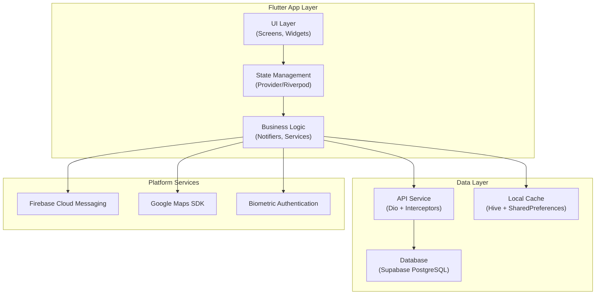

# Design Document: KJAC Mobile App (Flutter)

## Overview

The KJAC Mobile App is a unified Flutter application serving two distinct user roles: **Customers** and **Technicians**. This design document outlines the architecture, components, data models, and testing strategy for implementing the complete mobile app experience for Klein & Justin Airconditioning (KJAC).

### Goals
- Provide secure, role-based access for customers and technicians
- Enable complete booking lifecycle from submission through completion
- Support real-time status tracking and notifications
- Ensure responsive performance on mid-range devices
- Maintain offline capability with local data caching
- Deliver a consistent design system across iOS and Android
- **MATCH WEB APP DESIGN EXACTLY**

### Non-Goals
- This design does not cover the admin web panel functionality
- QR/Barcode scanning features are excluded from initial release
- Dark mode and multi-language support are future enhancements

---

## Architecture

### High-Level Architecture



### State Management Strategy

| Pattern | Use Case | Example |
|---------|----------|---------|
| `ChangeNotifier` | Simple UI state | Loading indicators, form validation |
| `Provider` | Simple state sharing | Current user, theme preference |
| `Riverpod` | Complex state with dependencies | Booking list, appointment schedule |
| `AsyncNotifier` | API calls with loading/error states | Fetch bookings, submit payment |
| `StateNotifier` | Local data manipulation | Cart management, local cache |

### Navigation Architecture

```mermaid
graph LR
    A["App"] --> B["SplashScreen"]
    B --> C{"Authentication State"}
    C -->|Not Authed| D["AuthRouter"]
    C -->|New User| E["Onboarding"]
    C -->|Authenticated| F["Role Router"]
    
    D --> D1["LoginScreen"]
    D --> D2["CustomerRegistration"]
    D --> D3["TechnicianSignIn"]  <!-- NO TechnicianRegistration -->
    D --> D4["ForgotPassword"]
    D --> D5["ResetPassword"]
    
    F -->|"Customer"| G["CustomerRouter"]
    F -->|"Technician"| H["TechnicianRouter"]
    
    G --> G1["HomeScreen"]
    G --> G2["MyBookingsScreen"]
    G --> G3["CreateBookingScreen"]
    G --> G4["BookingDetailScreen"]
    G --> G5["UploadPaymentScreen"]
    G --> G6["ProfileScreen"]
    G --> G7["ChatScreen"]
    
    H --> H1["HomeScreen"]
    H --> H2["AppointmentsScreen"]
    H --> H3["AppointmentDetailScreen"]
    H --> H4["ScheduleCalendarScreen"]
    H --> H5["CustomerNavigationScreen"]
    H --> H6["ProfileScreen"]
    H --> H7["RatingScreen"]  <!-- Business-wide rating -->
```

### Directory Structure

```
lib/
├── main.dart
├── core/
│   ├── constants/
│   │   ├── app_colors.dart       <!-- KJAC color palette from web -->
│   │   ├── app_strings.dart
│   │   └── app_theme.dart        <!-- Manrope, JetBrains Mono fonts -->
│   ├── exceptions/
│   │   ├── app_exception.dart
│   │   └── network_exception.dart
│   ├── utils/
│   │   ├── date_formatter.dart
│   │   ├── phone_validator.dart
│   │   └── storage_manager.dart
│   └── widgets/
│       ├── buttons/              <!-- Match web Button component -->
│       ├── cards/                <!-- Match web Card component -->
│       ├── inputs/               <!-- Match web Input component (44px) -->
│       └── loading/              <!-- Skeleton loaders -->
├── features/
│   ├── auth/
│   │   ├── data/
│   │   │   ├── models/
│   │   │   └── repositories/
│   │   ├── domain/
│   │   │   ├── entities/
│   │   │   └── use_cases/
│   │   └── presentation/
│   │       ├── providers/
│   │       └── screens/
│   ├── customer/
│   │   ├── data/
│   │   │   ├── models/
│   │   │   └── repositories/
│   │   ├── domain/
│   │   │   ├── entities/
│   │   │   └── use_cases/
│   │   └── presentation/
│   │       ├── providers/
│   │       └── screens/
│   ├── technician/
│   │   ├── data/
│   │   │   ├── models/
│   │   │   └── repositories/
│   │   ├── domain/
│   │   │   ├── entities/
│   │   │   └── use_cases/
│   │   └── presentation/
│   │       ├── providers/
│   │       └── screens/
│   └── shared/
│       └── presentation/
│           ├── providers/
│           └── screens/
├── infra/
│   ├── api/
│   │   ├── dio_client.dart
│   │   └── interceptors/
│   ├── database/
│   │   ├── supabase_client.dart
│   │   └── tables/
│   └── storage/
│       ├── hive_service.dart
│       └── secure_storage.dart
└── router/
    ├── app_router.dart
    └── route_names.dart
```

---

## Design System (MUST MATCH WEB APP EXACTLY)

### Typography

**From `frontend/src/index.css`:**
```css
--font-primary: "Manrope", "Inter", system-ui, -apple-system, sans-serif;
--font-technical: "JetBrains Mono", "Courier New", monospace;
--font-fallback: "Inter", system-ui, -apple-system, sans-serif;
```

**Mobile Implementation:**
- **Primary Font**: Manrope (iOS fallback to Inter)
- **Technical Font**: JetBrains Mono (fallback to monospace)
- **Font Weights**: Regular (400), SemiBold (600), Bold (700)

### Color Palette (KJAC Design Tokens)

**From `frontend/src/index.css`:**
```css
--color-primary-400: #38b6ff;    <!-- Main blue -->
--color-primary-600: #0090e6;    <!-- Primary actions -->
--color-success-600: #16a34a;    <!-- Success states -->
--color-warning-600: #d97706;    <!-- Warning/Proposed -->
--color-error-600: #dc2626;      <!-- Error states -->
--color-info-600: #2563eb;       <!-- Info -->
--color-teal-600: #0d9488;       <!-- Active/Assigned -->
```

**Usage:**
- Primary: Buttons, primary actions, active states
- Success: Approved, completed, positive states
- Warning: Proposed schedule, pending, caution
- Error: Errors, failed, cancelled
- Info: Informational messages
- Teal: Active appointments, assigned status

### UI Components (Match Web App Exactly)

**Buttons:**
- Radius: `rounded-lg` (0.5rem)
- Sizes: `default` (min-h-44px), `sm` (min-h-36px), `lg` (min-h-52px)
- Variants: `primary`, `secondary`, `destructive`, `outline`, `ghost`, `link`
- Active: `scale-[0.98]`
- Disabled: `opacity-50`, no hover/active effects

**Cards:**
- Border: `border-gray-200`
- Background: `bg-white`
- Radius: `rounded-lg` (0.5rem)
- Shadow: `shadow-sm`
- Padding: `py-6`, `px-4`

**Input Fields (iOS Human Interface Guidelines):**
- Min height: **44px** (touch target requirement)
- Border: `border-gray-200`
- Focus: `border-primary-600`
- Radius: `rounded-lg` (0.5rem)
- Password toggle: Eye/EyeOff icons (Lucide React)

**Badges:**
- Pill shape: `rounded-full`
- Variants: `default`, `secondary`, `destructive`, `success`, `warning`, `info`, `teal`, `slate`
- Text: `xs font-semibold`

**Scrolling (Ghost Pill-and-Groove):**
- Thin, transparent by default
- Fades in on hover/scroll (100ms ease)
- Groove: `bg-gray-400/10`
- Bar: `bg-gray-300/50`

**Icons:**
- **Lucide React** compatible icons
- Common: Loader2, Send, Trash2, CalendarOff, ChevronLeft, ChevronRight, Eye, EyeOff, Star

### Loading States

**Skeleton Loaders:**
- Match web `CardSkeleton` pattern
- Light gray placeholder with animation
- Rounded corners matching UI components
- Used for: Booking cards, technician cards, list items

---

## Components and Interfaces

### Core Services

#### AuthService
```dart
abstract class AuthService {
  Future<bool> login(String email, String password);
  Future<bool> registerCustomer(CustomerRegistrationData data);
  Future<void> acceptTechnicianInvite(String token, TechnicianInviteData data);
  Future<void> forgotPassword(String email);
  Future<void> resetPassword(String token, String newPassword);
  Future<bool> verifyBiometric();
  Future<void> logout();
  Stream<User?> get userStream;
}
```

#### BookingService
```dart
abstract class BookingService {
  Future<List<Booking>> getBookingsByStatus(BookingStatus status);
  Future<Booking> createBooking(CreateBookingData data);
  Future<void> updateBookingStatus(String bookingId, BookingStatus status);
  Future<void> acceptSchedule(String bookingId);
  Future<void> declineSchedule(String bookingId);
  Future<void> uploadPayment(String bookingId, String receiptUrl);
  Future<void> cancelBooking(String bookingId);
}
```

#### TechnicianService
```dart
abstract class TechnicianService {
  Future<List<Appointment>> getTodayAppointments();
  Future<void> updateJobStatus(String appointmentId, JobStatus status);
  Future<void> updateLocation(double latitude, double longitude);
  Future<void> completeJob(String appointmentId, {String? note});
}
```

### Data Models

#### User Entity
```dart
class User {
  final String id;
  final String email;
  final String firstName;
  final String lastName;
  final String? middleName;
  final String phone;
  final String? profilePicture;
  final UserRole role;
  final bool isEmailVerified;
  final String status;
  final DateTime createdAt;
  
  User({
    required this.id,
    required this.email,
    required this.firstName,
    this.middleName,
    required this.lastName,
    required this.phone,
    this.profilePicture,
    required this.role,
    required this.isEmailVerified,
    required this.status,
    required this.createdAt,
  });
  
  User copyWith({...});
  Map<String, dynamic> toJson();
  factory User.fromJson(Map<String, dynamic> json);
}
```

#### Booking Entity
```dart
class Booking {
  final String id;
  final String referenceId;
  final String customerId;
  final String? technicianId;
  final BookingStatus status;
  final ServiceType serviceType;
  final String? serviceDescription;
  final List<String> imageUrls;
  final DateTime scheduledDate;
  final TimeRange? timeSlot;
  final Address address;
  final double downPayment;
  final double? estimatedCost;
  final bool isPaymentUploaded;
  final bool isPaymentApproved;
  final DateTime? paymentUploadedAt;
  final DateTime? appointmentConfirmedAt;
  final DateTime createdAt;
  final DateTime? updatedAt;
  
  Booking({
    required this.id,
    required this.referenceId,
    required this.customerId,
    this.technicianId,
    required this.status,
    required this.serviceType,
    this.serviceDescription,
    required this.imageUrls,
    required this.scheduledDate,
    this.timeSlot,
    required this.address,
    required this.downPayment,
    this.estimatedCost,
    required this.isPaymentUploaded,
    required this.isPaymentApproved,
    this.paymentUploadedAt,
    this.appointmentConfirmedAt,
    required this.createdAt,
    this.updatedAt,
  });
  
  Booking copyWith({...});
  Map<String, dynamic> toJson();
  factory Booking.fromJson(Map<String, dynamic> json);
}
```

### API Interfaces

#### Auth API
```dart
abstract class AuthApi {
  Future<AuthResponse> login(LoginRequest request);
  Future<void> registerCustomer(CustomerRegistrationRequest request);
  Future<void> acceptTechnicianInvite(String token, TechnicianInviteData data);
  Future<void> forgotPassword(ForgotPasswordRequest request);
  Future<void> resetPassword(ResetPasswordRequest request);
  Future<User> getCurrentUser();
}
```

#### Booking API
```dart
abstract class BookingApi {
  Future<List<BookingResponse>> getBookings(String status);
  Future<BookingResponse> createBooking(CreateBookingRequest request);
  Future<void> updateBookingStatus(String bookingId, StatusUpdateRequest request);
  Future<void> acceptSchedule(String bookingId);
  Future<void> declineSchedule(String bookingId);
  Future<void> uploadPayment(String bookingId, PaymentUploadRequest request);
  Future<void> cancelBooking(String bookingId);
}
```

---

## Data Models

### Core Models

```dart
enum UserRole { customer, technician, admin }

enum BookingStatus {
  submitted,
  proposed,
  scheduled,
  confirmed,
  assigned,
  ongoing,
  completed,
  cancelled,
  expired,
  rescheduled,
  alternative_proposed,
  awaiting_payment,
}

enum JobStatus {
  onTheWay,
  arrived,
  inProgress,
  completed,
}

enum ServiceType {
  repair,
  installation,
  maintenance,
  cleaning,
  installationAndRepair,
  other,
}

enum TechnicianStatus {
  active,
  inactive,
  suspended,
}
```

### Local Cache Models (Hive)

```dart
@HiveType(typeId: 0)
class CachedBooking {
  @HiveField(0) final String id;
  @HiveField(1) final String referenceId;
  @HiveField(2) final String status;
  @HiveField(3) final DateTime scheduledDate;
  @HiveField(4) final String serviceType;
  @HiveField(5) final bool isPaymentUploaded;
  @HiveField(6) final bool isPaymentApproved;
  @HiveField(7) final DateTime lastSynced;
  
  CachedBooking({...});
  Map<String, dynamic> toMap();
  factory CachedBooking.fromMap(Map<String, dynamic> map);
}

@HiveType(typeId: 1)
class CachedMessage {
  @HiveField(0) final String id;
  @HiveField(1) final String senderId;
  @HiveField(2) final String senderRole;
  @HiveField(3) final String content;
  @HiveField(4) final DateTime createdAt;
  @HiveField(5) final bool isRead;
  
  CachedMessage({...});
  Map<String, dynamic> toMap();
  factory CachedMessage.fromMap(Map<String, dynamic> map);
}
```

---

## Correctness Properties

### Property 1: Navigation based on authentication state

*For any* app launch, the splash screen duration is exactly 2 seconds, and navigation proceeds correctly based on authentication state and onboarding completion.

**Validates: Requirements 1.1, 1.2, 1.3**

### Property 2: Registration data validation

*For any* customer registration attempt, the app properly validates input data and rejects invalid submissions.

**Validates: Requirements 1.4, 1.5**

### Property 3: Booking status transitions

*For any* booking, status transitions follow the defined state machine:
- `submitted` → `proposed` (admin proposes time)
- `proposed` → `scheduled` (customer accepts)
- `scheduled` → `confirmed` (payment approved)
- `confirmed` → `assigned` (admin assigns tech)
- `assigned` → `ongoing` (tech starts work)
- `ongoing` → `completed` (tech completes work)
- Any state → `cancelled` (with reason)

**Validates: Requirements 2.1, 2.5, 2.6, 2.7, 2.8**

### Property 4: Payment upload workflow

*For any* payment upload attempt, the app handles the complete workflow.

**Validates: Requirements 3.1, 3.2, 3.3, 3.4, 3.5, 3.6**

### Property 5: Technician status updates

*For any* technician job status update, the app maintains consistency:
- Only valid transitions: `onTheWay` → `arrived` → `inProgress` → `completed`
- GPS coordinates included in status updates
- Status changes trigger notifications

**Validates: Requirements 4.1, 4.2, 4.3, 4.4, 4.5, 4.6**

### Property 6: Rating calculation (business-wide)

*For any* rating submission, the average rating is calculated for KJAC as a whole.

**Validates: Requirements 5.1, 5.2, 5.3, 5.4**

### Property 7: Offline data synchronization

*For any* offline scenario, the app maintains data consistency.

**Validates: Requirements 9.1, 9.2, 9.3, 9.4, 9.5**

### Property 8: Authentication security

*For any* authentication attempt, security requirements are enforced.

**Validates: Requirements 1.6, 1.7, 1.8, 10.4, 10.5**

---

## Error Handling

### Network Errors

```dart
class NetworkException implements Exception {
  final String message;
  final int? statusCode;
  final String? errorCode;
  
  NetworkException({
    required this.message,
    this.statusCode,
    this.errorCode,
  });
}
```

### Business Logic Errors

```dart
class BusinessLogicException implements Exception {
  final String message;
  final String code;
  
  BusinessLogicException({
    required this.message,
    required this.code,
  });
}
```

### UI Error States

| State | Display | Action |
|-------|---------|--------|
| Loading | Spinner with primary color | None (awaiting response) |
| Error | Error message card | Retry button |
| Empty | Illustration + message | CTA button |
| Offline | Badge + indicator | Auto-retry when online |

---

## Testing Strategy

### Property-Based Testing Configuration

**Library Choice**: `test` package with `fast_check` or `quiver`
**Test Execution**: Minimum 100 iterations per property test

### Test Categories

| Test Type | Coverage | Examples |
|-----------|----------|----------|
| Unit Tests | Business logic functions | Booking status transitions, rating calculations |
| Property Tests | Universal properties | Navigation state machine, data validation |
| Integration Tests | API + DB interactions | Booking creation flow, payment upload |
| Widget Tests | UI components | Form validation, loading states |
| Integration Tests | User flows | Complete booking flow, onboarding flow |

### Test Coverage Requirements

| Area | Minimum Coverage |
|------|------------------|
| Business Logic | 90% |
| Data Models | 100% |
| UI Components (critical) | 80% |
| User Flows | 100% |

### Performance Testing

```dart
test('App launches within 3 seconds', () {
  final start = DateTime.now();
  await tester.pumpWidget(const KJACApp());
  final duration = DateTime.now().difference(start);
  
  expect(duration.inMilliseconds, lessThan(3000));
});
```

---

## Implementation Notes

### Key Implementation Decisions

1. **State Management**: Provider for simple state, Riverpod for complex state
2. **Navigation**: GoRouter for type-safe routing
3. **API Client**: Dio with interceptors for auth, logging, error handling
4. **Local Storage**: Hive for structured data, SharedPreferences for preferences
5. **Design System**: Match web app exactly (Manrope fonts, KJAC colors)

### Performance Optimizations

1. Lazy Loading: Screens load data only when opened
2. Image Caching: CachedNetworkImage for repeated image loading
3. Pagination: Booking lists use pagination
4. Throttling: Location updates every 30 seconds
5. Connection Pooling: Reuse Dio client instances

### Security Considerations

1. HTTPS Only: All API calls use HTTPS
2. Token Refresh: Automatic token refresh before expiration
3. Biometric Auth: Secure enclave storage for credentials
4. Data Encryption: Sensitive data encrypted at rest
5. Root Detection: App warns if device is compromised

### Future Enhancements

The following features are planned but excluded from initial release:

1. QR/Barcode Scanning: Inventory item tracking via camera
2. In-app Camera: Service photos and documentation
3. Push Notification Preferences: Granular control
4. Dark Mode: System theme detection
5. Multi-language: Tagalog and English support
6. Offline Forms: Complete offline form completion
7. Voice Commands: Hands-free technician operation
8. Analytics Dashboard: Customer and technician insights

---

**Document Version**: 1.1  
**Last Updated**: September 18, 2026  
**Maintained By**: KJAC Development Team